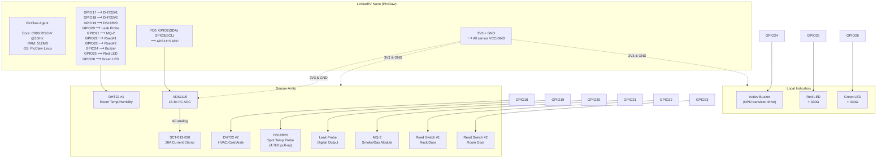

# 🔌 Wiring Guide — DC Guardian

> **Board:** LicheeRV Nano (PicClaw‑ready) | **Logic Level:** 3.3V | **Last Updated:** June 2026

---

## 📊 Pin Map (Quick Reference)

| Function | Module | LicheeRV Nano Pin | PicClaw GPIO Alias | Notes |
|----------|--------|:-----------------:|:-------------------:|-------|
| **Room temp/humidity** | DHT22 #1 (Data) | GPIO17 | `sensor.dht22_room` | 10kΩ pull‑up if module lacks one |
| **HVAC temp/humidity** | DHT22 #2 (Data) | GPIO18 | `sensor.dht22_hvac` | Keep cable < 2 m for reliability |
| **Spot temperature** | DS18B20 (Data) | GPIO19 | `sensor.ds18b20_spot` | **4.7kΩ pull‑up REQUIRED** |
| **Water leak** | Leak probe (DO) | GPIO20 | `sensor.leak` | Active HIGH when wet |
| **Smoke / gas** | MQ‑2 (DO) | GPIO21 | `sensor.smoke` | Module comparator output |
| **Rack door** | Reed switch #1 | GPIO22 | `sensor.door_rack` | Enable internal pull‑UP |
| **Room door** | Reed switch #2 | GPIO23 | `sensor.door_room` | Enable internal pull‑UP |
| **Audible alert** | Active buzzer (SIG) | GPIO24 | `indicator.buzzer` | Drive via NPN transistor (2N2222) |
| **Red LED** | LED + 330Ω | GPIO25 | `indicator.led_red` | Active HIGH = alert |
| **Green LED** | LED + 330Ω | GPIO26 | `indicator.led_green` | Active HIGH = healthy |
| **I²C SDA** | ADS1115 → SDA | GPIO2 (I²C0) | — | 3.3V logic, 10kΩ pull‑up on module |
| **I²C SCL** | ADS1115 → SCL | GPIO3 (I²C0) | — | 3.3V logic, 10kΩ pull‑up on module |
| **3.3V power** | All VCC pins | 3V3 (pin 1, 17, 36) | — | Max total draw: ~250 mA |
| **Ground** | All GND pins | GND (pin 9, 14, 39) | — | Star‑ground to one point |

---

## 🖼️ Wiring Overview (Mermaid Diagram)



---

## 🧩 Fritzing‑Style Breadboard Layout (ASCII)

```
        ╔══════════════════════════════════════════════════════════════════╗
        ║               LicheeRV Nano (top view, pins down)                ║
        ║  ┌──────────────────────────────────────────────────────────┐   ║
        ║  │  ⬛⬛⬛⬛⬛⬛⬛⬛⬛⬛⬛⬛⬛⬛⬛⬛⬛⬛⬛⬛⬛⬛⬛⬛⬛⬛⬛⬛⬛⬛  │   ║
        ║  │  2  4  6  8 10 12 14 16 18 20 22 24 26 28 30           │   ║
        ║  │  1  3  5  7  9 11 13 15 17 19 21 23 25 27 29           │   ║
        ║  └──────────────────────────────────────────────────────────┘   ║
        ║  Pin 1: 3V3    Pin 2: 3V3    Pin 39: GND                       ║
        ╚══════════════════════════════════════════════════════════════════╝
                                  │
                                  │ Dupont jumper wires
                                  ▼
        ╔══════════════════════════════════════════════════════════════════╗
        ║                      400‑tie Breadboard                         ║
        ║  ┌──────┬──────┬──────────────────────────────────────────┐    ║
        ║  │ POWER│ GND  │                                          │    ║
        ║  │  (+ )│ (- ) │                                          │    ║
        ║  ├──────┴──────┤                                          │    ║
        ║  │ 3V3 rail────┼──────────────┬──────┬──────┬──────┐      │    ║
        ║  │             │              │      │      │      │      │    ║
        ║  │ DHT22#1     │ DHT22#2      │MQ‑2  │Leak  │ADS1115     │    ║
        ║  │ ┌───┐       │ ┌───┐        │┌───┐ │┌───┐ │┌──────┐   │    ║
        ║  │ │VCC│────3V3 │ │VCC│────3V3 ││VCC│ ││VCC│ ││VDD  │─3V3│    ║
        ║  │ │DAT│──GPIO17│ │DAT│──GPIO18││DO │─GPIO21││DO │─GPIO20││GND │    ║
        ║  │ │GND│────GND │ │GND│────GND ││GND│ ││GND│ ││ADDR│──GND│    ║
        ║  │ └───┘       │ └───┘        │└───┘ │└───┘ ││SCL │─GPIO3│    ║
        ║  │             │              │      │      ││SDA │─GPIO2│    ║
        ║  │ DS18B20     │ Reed#1       │Reed#2│Buzzer││A0  │←SCT─│    ║
        ║  │ ┌───┐       │ ┌───┐        │┌───┐ │┌───┐ │└──────┘   │    ║
        ║  │ │VCC│────3V3 │ │   │        ││   │ ││SIG│─GPIO24     │    ║
        ║  │ │DAT│──GPIO19│ │   │──GPIO22││   │─GPIO23│VCC│────3V3│    ║
        ║  │ │GND│────GND │ │   │──GND  ││   │──GND │GND│────GND │    ║
        ║  │ └───┘       │ └───┘        │└───┘ │└───┘ │           │    ║
        ║  │   ↑ 4.7kΩ   │              │      │      │           │    ║
        ║  │  ┌─┴─┐      │              │      │      │ Red LED   │    ║
        ║  │  │ R │────3V3│              │      │      │ ┌──┐     │    ║
        ║  │  └───┘      │              │      │      │ │A │─GPIO25   │    ║
        ║  │             │              │      │      │ │K │─GND│     │    ║
        ║  │             │              │      │      │ │330│     │    ║
        ║  │             │              │      │      │ └──┘     │    ║
        ║  │             │              │      │      │ Green LED│    ║
        ║  │             │              │      │      │ ┌──┐     │    ║
        ║  │             │              │      │      │ │A │─GPIO26   │    ║
        ║  │             │              │      │      │ │K │─GND│     ║
        ║  │             │              │      │      │ │330│     │    ║
        ║  │             │              │      │      │ └──┘     │    ║
        ║  └─────────────┴──────────────┴──────┴──────┴──────────┘    ║
        ╚══════════════════════════════════════════════════════════════════╝

        SCT-013-030 (external, not on breadboard):
          ┌──────────┐
          │  ⭕ (clamp around LIVE conductor ONLY)  │
          │  3.5mm jack ──→ ADS1115 A0              │
          │  (jack tip = signal, sleeve = GND)       │
          └──────────┘
```

---

## 🔌 Step‑by‑Step Wiring Sequence

### Phase 1 — Power Rails (always first)
1. Connect a **3V3 pin** (e.g., pin 1) to breadboard **red rail** (+).
2. Connect a **GND pin** (e.g., pin 39) to breadboard **blue rail** (−).
3. Verify continuity with a multimeter before connecting any sensor.

### Phase 2 — I²C Bus (ADS1115)
4. Connect ADS1115 **VDD** → 3V3 rail.
5. Connect ADS1115 **GND** → GND rail.
6. Connect ADS1115 **SCL** → GPIO3 (pin 5).
7. Connect ADS1115 **SDA** → GPIO2 (pin 3).
8. Connect ADS1115 **ADDR** → GND (I²C address = 0x48).
9. Keep I²C wires < 30 cm to avoid signal degradation.

### Phase 3 — Digital Sensors
10. **DHT22 #1:** VCC→3V3, DATA→GPIO17, GND→GND. Add 10kΩ pull‑up from DATA to 3V3 if module lacks one.
11. **DHT22 #2:** VCC→3V3, DATA→GPIO18, GND→GND. Same pull‑up note.
12. **DS18B20:** Red→3V3, Yellow(DATA)→GPIO19, Black→GND. **CRITICAL:** 4.7kΩ pull‑up between DATA and 3V3.
13. **MQ‑2:** VCC→3V3, DO→GPIO21, GND→GND. (The AO pin is unused — see notes below.)
14. **Leak probe:** VCC→3V3, DO→GPIO20, GND→GND.
15. **Reed switch #1:** One leg→GPIO22, other leg→GND. Enable internal pull‑UP on GPIO22.
16. **Reed switch #2:** One leg→GPIO23, other leg→GND. Enable internal pull‑UP on GPIO23.

### Phase 4 — Outputs
17. **Active buzzer:** Positive→GPIO24 (via NPN transistor collector), Negative→GND. (GPIO24 drives the transistor base through a 1kΩ resistor.)
18. **Red LED:** Anode→GPIO25 (through 330Ω), Cathode→GND.
19. **Green LED:** Anode→GPIO26 (through 330Ω), Cathode→GND.

### Phase 5 — Current Sensing (after everything else)
20. Connect SCT‑013 3.5mm jack to ADS1115 A0 (tip) and GND (sleeve).
21. **Clamp around ONE live conductor only** — never around the full cable bundle.

---

## 📐 SCT‑013 & ADS1115 Configuration

| Parameter | Value | Notes |
|-----------|-------|-------|
| ADS1115 address | 0x48 | ADDR pin → GND |
| ADC range | ±4.096V | Typical for SCT‑013‑030 output |
| SCT‑013‑030 output | 0–1V AC (at 30A) | 1.5V DC bias on signal |
| Sample rate | 860 SPS max | PicClaw polls at 1‑minute intervals |
| Burden resistor | Built into SCT‑013‑030 module | No external burden needed |

> ⚠️ The SCT‑013‑030 already includes burden and bias resistors. Do **not** add an external burden resistor unless using an SCT‑013‑000 (unloaded) variant.

---

## 🧪 Verification (Before Power‑On)

1. **Continuity check:** Probe between 3V3 rail and GND rail — should read **open** (infinite resistance).
2. **Visual check:** Confirm no solder bridges or stray wire strands bridging rails.
3. **Polarity check:** Verify all VCC→3V3, GND→GND, DATA→GPIO assignments.
4. **Pull‑up check:** Measure DS18B20 DATA→3V3 — should read ~4.7kΩ.
5. **Voltage check (first power‑on):** Probe between 3V3 and GND — expect **3.25–3.35V**.

---

## 📍 Installation Placement Rules

| Sensor | Placement | Mounting |
|--------|-----------|----------|
| DHT22 #1 (room) | Rack exhaust path, 1.5 m above floor | Velcro or screw‑mount to rack rail |
| DHT22 #2 (HVAC) | Cold‑aisle ceiling tile or HVAC vent outlet | Zip‑tie to cable tray |
| DS18B20 | Taped to cooling loop return pipe | Kapton tape + thermal paste |
| Leak probe | Lowest floor point near cooling pipes | Sit flat on floor, no adhesives |
| MQ‑2 | Rack front air intake, 1U space | Stick with 3M double‑sided foam |
| Reed switches | Door frame + magnet on door edge | Adhesive backing (MC‑18 style) |
| SCT‑013 | UPS/main breaker panel (on one branch) | Snap‑around installation |
| Enclosure | Rack rear, below patch panel | Velcro or L‑bracket |

---

## ⚡ Important Wiring Rules

- ✅ **Star‑ground:** All GND connections should converge at one breadboard point.
- ✅ **Separate analog & digital:** Keep SCT‑013/ADS1115 wiring away from GPIO pulse lines.
- ✅ **Twisted pairs:** For DS18B20 and DHT22 cables > 1m, twist DATA and GND together.
- ⚠️ **Never clamp SCT‑013 around full cable bundle** — only individual conductors.
- ❌ **No mains voltage** on the breadboard. Ever.
- ❌ **No sensors powered before board** — the board 3V3 rail should be active first.
